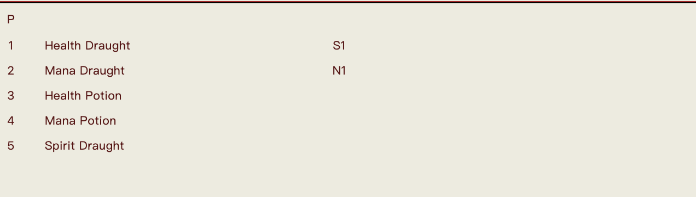

**English** | [繁體中文](README.zh-TW.md)

# HV Auto Battle & Encounter

Tampermonkey userscript for automating HentaiVerse Arena battles and encounter farming on E-Hentai.

## Features

### ⚔ Arena Auto Battle (`hentaiverse.org`)
- Fully automated combat with priority-based action system
- Auto-continues to next round between waves
- **Stops on last round** — won't navigate away from results
- Elite/boss priority targeting
- CD-aware item usage (potions skipped when on cooldown)
- Channeling buff detection — casts Heartseeker for free when proc'd
- Spirit stance management

### 🎯 Encounter Auto Refresh (`e-hentai.org/news.php`)
- Timer-based page refresh every 30 minutes
- Auto-detects monster encounters and opens battle popup
- Auto-enables battle mode in the popup window
- Countdown display on floating button
- Falls back to 1-minute retry if encounter doesn't appear on time

### 🚨 Anti-Cheat Protection
- **Riddle Master** detection on page load
- **Idle loop** detection (battle stalled)
- **Triple alert**: sound beeps + browser notification + tab title flash

## Installation

1. Install [Tampermonkey](https://www.tampermonkey.net/) browser extension
2. Click the Tampermonkey icon → Create a new script
3. Replace all content with the contents of `autoArena.user.js`
4. Save (Ctrl+S)

## Setup Requirements

The script relies on fixed quick button and item slot positions. Configure your in-game settings as follows before use:

### Quick Buttons

| Slot | Skill |
|------|-------|
| qb1 | Regen |
| qb2 | Heartseeker |
| qb3 | Heal spell 1 |
| qb4 | Heal spell 2 |

### Item Slots

| Slot | Item |
|------|------|
| 1 | Health Draught |
| 2 | Mana Draught |
| 3 | Health Potion |
| 4 | Mana Potion |
| 5 | Spirit Draught |

## Usage

### Arena Battle
1. Enter an Arena battle on `hentaiverse.org`
2. Click the `⚔ AUTO OFF` button (bottom-right) to start
3. Script fights automatically and continues between rounds
4. Stops when arena is cleared or anti-cheat is detected

### Encounter Farming
1. Go to `e-hentai.org/news.php`
2. Click the `🎯 ENCOUNTER OFF` button (bottom-right) to enable
3. Button shows countdown timer until next refresh
4. When a monster encounter appears, it auto-opens the battle and fights it

## Combat Priority

| Priority | Condition | Action |
|----------|-----------|--------|
| 1 | HP < 50% | Heal (qb3 → qb4 → Health Potion) |
| 2 | Channeling buff active | Cast Heartseeker (free MP) |
| 3 | MP < 20% | Mana Potion |
| 4 | No Regeneration buff | Health Draught |
| 5 | No Replenishment buff | Mana Draught |
| 6 | SP < 70%, no Refreshment | Spirit Draught |
| 7 | Regen ≤ 3 turns | Recast |
| 8 | Heartseeker ≤ 3 turns | Recast |
| 9 | OC > 80%, spirit inactive | Activate spirit |
| 10 | — | Attack (elite first) |

## GM Storage Keys

| Key | Mode | Purpose |
|-----|------|---------|
| `autoArena` | Battle | Auto-fight toggle |
| `autoEncounter` | Encounter | Auto-refresh toggle |
| `lastEncounterTime` | Encounter | Last encounter timestamp |
| `nextRefreshTime` | Encounter | Target time for next refresh |

## License

MIT
